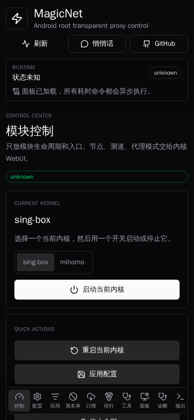

# MagicNet

<div align="center">
  <p>
    <a href="kam.toml"></a>
    <a href="LICENSE"></a>
    <a href="Cargo.toml"></a>
    <a href="webui/package.json"></a>
    <a href="kam.toml"></a>
    <a href="https://github.com/KernelSU-Modules-Repo/MagicNet/releases"></a>
  </p>
</div>

<p align="center">
  <a href="#overview">Overview</a>
  · <a href="#quick-start">Quick Start</a>
  · <a href="#核心功能">核心功能</a>
  · <a href="#cli">CLI</a>
  · <a href="#mcp-自动化">MCP</a>
  · <a href="#english-summary">English</a>
</p>

MagicNet 是一个 Android root 戒网瘾模块，用于在真实设备上把“我再刷五分钟”改造成“页面怎么打不开了”。它面向自控力工程、深夜冲浪治理、注意力回收、热点共享劝退、分应用戒断和自动化反复横跳诊断。

> 需要 Magisk / KernelSU / APatch 等 root 管理器。当前版本：`v1.1.2`。Release 以发布页为准。

## Overview

MagicNet is an Android root network module for device-side traffic governance. It combines `magicnet0` TUN routing, mihomo/sing-box integration, a Vue WebUI, scriptable CLI commands, MCP diagnostics, hotspot handling, and VPN coexistence helpers.

Use it when you want a rooted Android device to enforce network rules below the app layer instead of relying on every app to respect a proxy setting.

## Quick Start

```bash
kam install LIghtJUNction/MagicNet
```

Or install the release package from the distribution repository:

```bash
kam -S MagicNet
kam install MagicNet.zip
```

## English Summary

MagicNet is a rooted Android module for transparent network control, focus recovery, and on-device diagnostics.

| Area | What it provides |
| --- | --- |
| Transparent routing | TUN and TProxy modes with a default `magicnet0` interface. |
| Policy control | Route groups for direct, proxy, block, domestic, media, AI, ads, LAN, and custom domains. |
| Runtime surfaces | WebUI for humans, CLI for scripts, MCP server for agent-assisted diagnosis. |
| Device scenarios | Rooted phone, tablet, testing device, always-on hotspot, or automation lab device. |
| Safety boundary | No bundled third-party connectivity resource; bring your own legal configuration. |

## 界面预览



## 定位：不是不让你上网，是帮你冷静一下

MagicNet 不分发任何第三方连通性资源，也不内置可直接使用的外部出口。本仓库只提供设备侧戒网瘾执行器、规则框架、配置导入入口和自动化控制面。

模块支持接入合法、合规、自有的节点或连通性配置；接入非法节点、未授权资源、来路不明订阅、以及“朋友发我的我也不知道是什么”的行为，均与本人和本项目无关。

## 核心功能

- Android root 级别的注意力治理，默认虚拟网卡名为 `magicnet0`，名字很赛博，作用很朴素：把流量抓过来问一句“你真的要去这个网站吗”。
- 支持接入合法代理节点和合法配置，用于自有设备、自有网络和合规测试。非法用法不属于功能，只属于用户的想象力。
- 可封锁谷歌、视频站、娱乐网站、广告域名等站点。把对应规则组、策略组或域名规则设置为 `reject` / `block`，它们就会进入电子小黑屋。
- 境内域名也可以设置为 `reject`。这不是技术限制，这是意志力外包：短视频、购物、论坛、游戏资讯，都可以按域名劝退。
- TUN / TProxy 两种戒网瘾模式，可显式切换。一个像正经系统工程，一个像“不知不觉手机变乖了”。
- DNS 泄露检查和加密 DNS 配置模板，避免嘴上说戒网瘾，DNS 还在偷偷告密。
- 国内/境外/AI/媒体/广告/局域网等规则框架，既能精准放行工作需要，也能精准封印摸鱼入口。
- 分应用策略，支持黑名单和白名单模式：可以只管浏览器，也可以除了指定应用全都管。
- 热点客户端 `proxy` / `direct` 两种内部模式，防止你戒了自己的网瘾，又把网瘾批发给旁边设备。
- VPN 共存模式，便于与 Tailscale、WireGuard、OpenVPN、ZeroTier、WARP 等隧道同时运行。
- WebUI、CLI、MCP 三套控制面。人类点按钮，脚本跑命令，agent 做诊断，各司其职。
- watchdog 保活和配置监听，避免戒网瘾模块自己先戒了工作。
- 支持包导出会脱敏 URL、token、secret、password 等敏感字段，方便求助时不顺手公开人生。

## 两种戒网瘾模式

### TUN 模式：一本正经的戒断工程

TUN 模式会在系统里创建一张虚拟网卡，比如 `magicnet0`。设备上的流量先进入这张虚拟网卡，模块再根据规则决定它是正常通行、绕行、审计，还是被 `reject` 当场教育。

技术上看，它像是在 Android 里放了一个“网络交通辅导员”：IP 包来了，先排队，查规则，看 DNS，看目标域名，看应用来源，再决定下一跳。这个模式的好处是边界清楚、诊断方便、抓包友好，适合认真研究“我到底是怎么浪费时间的”。

简单说：TUN 模式不是不让你上网，它只是让每个数据包在出门前写一份请假条。

### TProxy 模式：不知不觉的温柔劝退

TProxy 模式更像透明拦截。应用以为自己还在正常联网，系统路由和防火墙规则已经在底层把连接引导到模块处理。它不需要每个应用显式配东西，也不需要用户天天盯着开关。

这就是它更“不知不觉”的原因：你打开网页，应用没报错，系统没弹窗，世界看起来和平常一样。直到某些娱乐网站、摸鱼域名、深夜搜索入口被规则温柔地送进 `reject`，你才发现今晚应该睡觉。

简单说：TProxy 模式不跟网瘾正面吵架，它选择改路牌。

## 怎么把网站关进小黑屋

如果只是想封掉某类网站，把对应规则组设置为 `reject` 即可。比如谷歌、媒体、广告、游戏资讯、短视频、购物站点，都可以按域名、规则集或分组处理。

自定义域名也可以走 CLI：

```bash
su -c /data/adb/modules/MagicNet/cli route list
su -c '/data/adb/modules/MagicNet/cli route add-domain block google.com'
su -c '/data/adb/modules/MagicNet/cli route add-domain block youtube.com'
su -c '/data/adb/modules/MagicNet/cli route add-domain block example.cn'
su -c /data/adb/modules/MagicNet/cli route apply
```

实际核心配置中如果使用的是 `reject` 策略组，就把目标域名或规则集指向 `reject`；CLI 的 `block` 是模块侧的封锁语义。名字不同，精神一致：别看了。

## 安装

### 使用 kam

```bash
kam install LIghtJUNction/MagicNet
```

### Termux / 本地构建安装

```bash
git clone https://github.com/LIghtJUNction/MagicNet.git
cd MagicNet
git submodule update --init --recursive
chmod +x kam.sh
./kam.sh
```

以上方式安装的是 Git 构建版本。

### Release 包

```bash
kam -S MagicNet
kam install MagicNet.zip
```

## 构建

```bash
git submodule update --init --recursive
kam build
```

构建产物位于：

```text
dist/MagicNet.zip
```

## 首次配置

安装后写入你的合法配置：

```bash
su -c '/data/adb/modules/MagicNet/cli setup "https://example.com/config"'
```

`cli setup` 会校验 URL、写入运行配置、更新设备侧配置、重载模块，并输出健康诊断结果。模块 WebUI 首页的“保存并启用”使用同一条 CLI 路径。

这些路径是兼容性实现细节；普通用户优先使用 WebUI 或 CLI，不需要手工编辑。

## CLI

模块内置可脚本化 CLI：

```bash
su -c /data/adb/modules/MagicNet/cli help
```

常用命令：

```bash
su -c /data/adb/modules/MagicNet/cli service status
su -c /data/adb/modules/MagicNet/cli service start
su -c /data/adb/modules/MagicNet/cli service stop
su -c /data/adb/modules/MagicNet/cli service restart
su -c /data/adb/modules/MagicNet/cli core select sing-box
su -c /data/adb/modules/MagicNet/cli core select mihomo
su -c /data/adb/modules/MagicNet/cli service restart sing-box
su -c /data/adb/modules/MagicNet/cli service restart mihomo
su -c /data/adb/modules/MagicNet/cli transparent set tun
su -c /data/adb/modules/MagicNet/cli transparent set tproxy
su -c /data/adb/modules/MagicNet/cli hotspot set proxy
su -c /data/adb/modules/MagicNet/cli hotspot set direct
su -c /data/adb/modules/MagicNet/cli config apply
su -c /data/adb/modules/MagicNet/cli health
su -c /data/adb/modules/MagicNet/cli diagnose
```

核心切换只使用 `.config/magicnet/core.conf` 里的 `MAGICNET_DEFAULT_CORE`，由 `cli core select <sing-box|mihomo>` 写入。旧的 `.disable_sing_box` 隐藏开关已经移除；不要再用隐藏文件禁用 sing-box。需要指定某次启动的核心时，直接执行 `cli service restart sing-box` 或 `cli service restart mihomo`。

配置、状态和诊断：

```bash
su -c /data/adb/modules/MagicNet/cli sub update-all
su -c /data/adb/modules/MagicNet/cli sub list
su -c '/data/adb/modules/MagicNet/cli setup "https://example.com/config"'
su -c /data/adb/modules/MagicNet/cli api stats
su -c /data/adb/modules/MagicNet/cli api close-all
su -c /data/adb/modules/MagicNet/cli support bundle
```

自定义戒断名单：

```bash
su -c /data/adb/modules/MagicNet/cli route list
su -c '/data/adb/modules/MagicNet/cli route add-domain proxy example.com'
su -c '/data/adb/modules/MagicNet/cli route add-domain direct example.cn'
su -c '/data/adb/modules/MagicNet/cli route add-domain block ads.example.com'
su -c /data/adb/modules/MagicNet/cli route apply
```

## MCP 自动化

MagicNet 可在设备上启动 MCP server，供本机 agent 通过 ADB 转发调用：

```bash
adb forward tcp:8765 tcp:8765
su -c /data/adb/modules/MagicNet/cli mcp enable
```

MCP 工具可管理配置源、封锁名单、备份、状态检查和脱敏上下文。默认关闭，需要用户显式启用。

## 戒网瘾工作流

1. 写入合法配置。
2. 启动模块并确认 `service status`。
3. 把不想看的站点、规则组或域名指向 `reject` / `block`。
4. 使用 `health` / `diagnose` 收集进程、接口、路由、监听端口、控制端和日志，确认模块真的在上班。
5. 分别测试工作站点、摸鱼站点、热点客户端路径和 DNS 行为。
6. 如果遇到“怎么又能打开了”，导出 `support bundle`，获得脱敏后的复现材料。

## DNS 告密检查

常用真机抓包方式：

```bash
adb shell 'su -M -c "timeout 10 tcpdump -ni rmnet_data0 \"port 53 or port 853\""'
```

不同设备的蜂窝出口可能是 `rmnet_data0`、`rmnet_data3` 或其它接口。先用以下命令确认出口：

```bash
adb shell 'su -M -c "ip route get 1.1.1.1; ip -br link"'
```

目标状态是访问测试期间没有明文 DNS/DoT 流量从物理出口偷偷跑出去。戒网瘾最怕嘴上 `reject`，DNS 在背后给你递地址。

## 热点与 VPN 共存

热点管控模式会识别热点网卡和 `magicnet0`，只补充必要的转发和 NAT 规则，不清空 Android 系统链。

VPN 共存模式会扫描 `tun*`、`wg*`、`tailscale*`、`zt*`、`warp*` 等外部隧道接口，并补充策略路由，让 overlay 网络继续按原 VPN 软件的路由走。

## 一本正经的技术说明

MagicNet 借鉴成熟 Android root 网络模块的“核心启动器、透明规则分层、配置合法性检查、手动控制、日志可追踪”思路，但把对外定位收敛为设备侧戒网瘾与注意力治理。TProxy、IPSET_LKM、VPN 共存和 MCP 都是显式启用或可选增强，不会在默认路径里偷偷替用户做决定。

## 工作流

仓库提供两个 GitHub Actions：

- `Validate MagicNet`：校验 `kam.toml`、Shell 脚本和底层运行配置。
- `Build MagicNet`：初始化子模块、下载构建依赖、执行 `kam build`，并上传 `dist/*.zip` artifact。

工作流不会自动提交、不会自动更新子模块指针，也不会把构建产物写回 Git 历史。需要更新子模块时，请在对应子项目提交后，在父项目显式提交新的 submodule 指针。

## 子项目

- 底层运行配置子项目 A。
- 底层运行配置子项目 B。
- [kamfw](https://github.com/MemDeco-WG/kamfw)：运行时辅助库。

## 参考与致谢

- [yumebox](https://github.com/YumeLira/YumeBox)
- [Mimic-Node](https://github.com/LIghtJUNction/Mimic-Node)
- [Loyalsoldier/clash-rules](https://github.com/Loyalsoldier/clash-rules)
- [DustinWin/ruleset_geodata](https://github.com/DustinWin/ruleset_geodata)
- [CHIZI-0618/AndroidTProxyShell](https://github.com/CHIZI-0618/AndroidTProxyShell)
- [CHIZI-0618/box4magisk](https://github.com/CHIZI-0618/box4magisk)
- [taamarin/box_for_magisk](https://github.com/taamarin/box_for_magisk)
- [Fanju6/NetProxy-Magisk](https://github.com/Fanju6/NetProxy-Magisk)
- [Fanju6/Proxylink](https://github.com/Fanju6/Proxylink)
- [TanakaLun/IPSET_LKM](https://github.com/TanakaLun/IPSET_LKM)

## 许可证

MIT，见 [LICENSE](LICENSE)。
