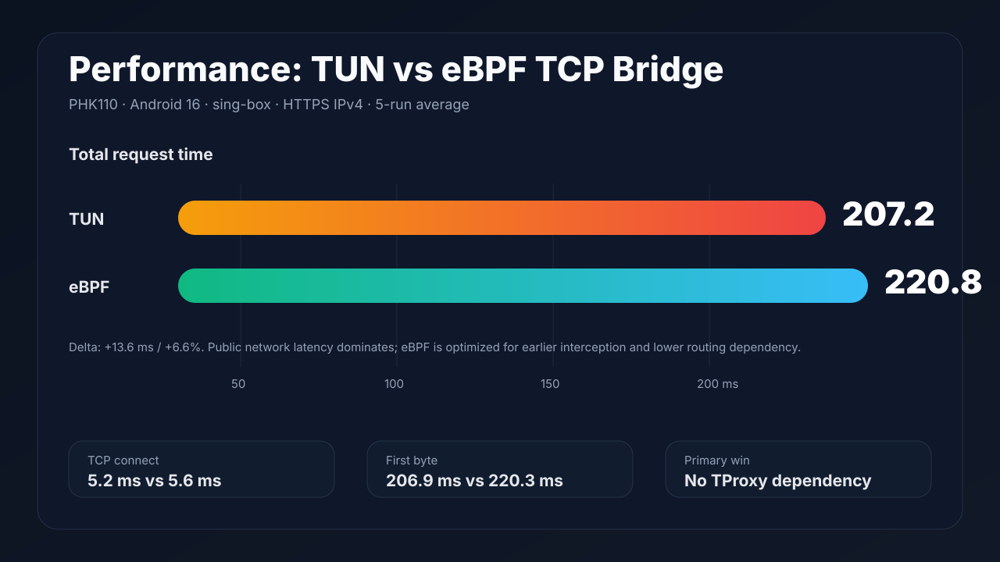

# MagicNet

<div align="center">
  <p>
    <a href="kam.toml"></a>
    <a href="LICENSE"></a>
    <a href="Cargo.toml"></a>
    <a href="webui/package.json"></a>
    <a href="kam.toml"></a>
    <a href="https://discord.gg/vXffnGge6"></a>
    <a href="https://github.com/KernelSU-Modules-Repo/MagicNet/releases"></a>
  </p>
</div>

<p align="center">
  <a href="#项目概览">项目概览</a>
  · <a href="#快速开始">快速开始</a>
  · <a href="#核心功能">核心功能</a>
  · <a href="#cli">CLI</a>
  · <a href="#mcp-自动化">MCP</a>
  · <a href="#社区">社区</a>
</p>

> [!IMPORTANT]
> DNS 防泄露必读：请打开系统设置，搜索 `DNS`，找到“私人 DNS”“私密 DNS”“Private DNS”或类似表述，把私人 DNS 关闭，不要设置为自动加密。必须让 DNS 正常走 53 端口，让 MagicNet 模块接管并代理 DNS；否则 Android 系统或浏览器可能直接使用 DoT/DoH，导致 DNS 泄露检测仍然显示外部解析器。

MagicNet 是一个 Android root 戒网瘾模块，用于在真实设备上把“我再刷五分钟”改造成“页面怎么打不开了”。它面向自控力工程、深夜冲浪治理、注意力回收、热点共享劝退、分应用戒断和自动化反复横跳诊断。

> 需要 Magisk / KernelSU / APatch 等 root 管理器。当前版本：`v1.1.6`。Release 以发布页为准。

## 项目概览

MagicNet 是一个 Android root 网络模块，用于设备侧透明流量治理。它组合了 `magicnet0` TUN 路由、mihomo / sing-box 核心集成、Vue WebUI、可脚本化 CLI、MCP 诊断、热点处理和 VPN 共存辅助能力。

当你希望在应用层之下统一执行网络规则，而不是指望每个 App 都遵守代理设置时，可以使用 MagicNet。

## 快速开始

```bash
kam install LIghtJUNction/MagicNet
```

也可以安装发行仓库里的模块包：

```bash
kam -S MagicNet
kam install MagicNet.zip
```

## 界面预览


## 定位：不是不让你上网，是帮你冷静一下

MagicNet 不分发任何第三方连通性资源，也不内置可直接使用的外部出口。本仓库只提供设备侧戒网瘾执行器、规则框架、配置导入入口和自动化控制面。

模块支持接入合法、合规、自有的节点或连通性配置；接入非法节点、未授权资源、来路不明订阅、以及“朋友发我的我也不知道是什么”的行为，均与本人和本项目无关。

## 核心功能

- Android root 级别的注意力治理，默认虚拟网卡名为 `magicnet0`，名字很赛博，作用很朴素：把流量抓过来问一句“你真的要去这个网站吗”。
- 支持接入合法代理节点和合法配置，用于自有设备、自有网络和合规测试。非法用法不属于功能，只属于用户的想象力。
- 可封锁谷歌、视频站、娱乐网站、广告域名等站点。把对应规则组、策略组或域名规则设置为 `reject` / `block`，它们就会进入电子小黑屋。
- 境内域名也可以设置为 `reject`。这不是技术限制，这是意志力外包：短视频、购物、论坛、游戏资讯，都可以按域名劝退。
- `auto` / TUN / eBPF 三种透明治理策略：默认 `auto` 会优先检查 eBPF 数据面，完整可用才启用；否则直接走 TUN 兜底。eBPF 是面向新内核的迁移路径，目标是绕开传统 TProxy / iptables 模块碎片化问题。
- DNS 泄露检查和加密 DNS 配置模板，避免嘴上说戒网瘾，DNS 还在偷偷告密。
- 国内/境外/AI/媒体/广告/局域网等规则框架，既能精准放行工作需要，也能精准封印摸鱼入口。
- 分应用策略，支持黑名单和白名单模式：可以只管浏览器，也可以除了指定应用全都管。
- 热点客户端 `proxy` / `direct` 两种内部模式，防止你戒了自己的网瘾，又把网瘾批发给旁边设备。
- VPN 共存模式，便于与 Tailscale、WireGuard、OpenVPN、ZeroTier、WARP 等隧道同时运行。
- WebUI、CLI、MCP 三套控制面。人类点按钮，脚本跑命令，agent 做诊断，各司其职。
- watchdog 保活和配置监听，避免戒网瘾模块自己先戒了工作。
- 支持包导出会脱敏 URL、token、secret、password 等敏感字段，方便求助时不顺手公开人生。

## 三种透明治理策略

### auto 模式：默认的 eBPF 优先策略

MagicNet 默认使用 `auto`。它不是盲目强开 eBPF，而是先确认 MagicNet eBPF loader、cgroup/connect 挂载、sock_ops 原始目的地索引、用户态 TCP bridge、DNS 53 专用重定向入口和 sing-box 本地入站都可用；只要关键环节不完整，就直接保留 TUN 入站并继续启动核心。

这样做的原因很现实：cgroup/connect 只能在内核里改写连接目标，代理核心还必须拿到“原始目的地”才能做真正透明代理。MagicNet 现在用 socket cookie 记录 connect 时的原始目标，再由 sock_ops 在连接建立后补齐客户端源端口索引，最后由本地 TCP bridge 通过 SOCKS5 CONNECT 转交给 sing-box mixed 入站。DNS 则单独处理：TCP 53 在 connect 阶段改写到 sing-box DNS 入站，UDP 53 通过 cgroup/udp sendmsg 改写到同一入口。若这些步骤在真机上任一失败，`auto` 会回退到 TUN，避免为了实验把手机网络赌进去。

### TUN 模式：一本正经的戒断工程

TUN 模式会在系统里创建一张虚拟网卡，比如 `magicnet0`。设备上的流量先进入这张虚拟网卡，模块再根据规则决定它是正常通行、绕行、审计，还是被 `reject` 当场教育。

技术上看，它像是在 Android 里放了一个“网络交通辅导员”：IP 包来了，先排队，查规则，看 DNS，看目标域名，看应用来源，再决定下一跳。这个模式的好处是边界清楚、诊断方便、抓包友好，适合认真研究“我到底是怎么浪费时间的”。

简单说：TUN 模式不是不让你上网，它只是让每个数据包在出门前写一份请假条。

### eBPF 模式：新内核路径

eBPF 模式面向较新的 Android 内核，目标是在 socket 建立或流量进入内核的更早阶段完成重定向，减少对 `xt_TPROXY`、`ip6tables_nat`、复杂 iptables 规则和设备私有内核模块的依赖。

Android 版本和内核要求：

- Android 12 之前：大量老旧内核，例如 Linux 4.19 / 5.4，默认没有开启 BTF 支持，eBPF 模式通常不可用或只能作为开发者实验能力。
- Android 12 / Android 13 及之后：谷歌对新内核，例如 Linux 5.10 / 5.15+，要求启用 `CONFIG_DEBUG_INFO_BTF=y`，较新的手机通常原生带 BTF，更适合作为 eBPF 模式的目标设备。
- 实际可用性仍以真机检测为准：至少需要 `CONFIG_BPF`、`CONFIG_BPF_SYSCALL`、`CONFIG_CGROUP_BPF`、bpffs、cgroup 和 MagicNet 自身 eBPF loader 可用。

当前定位：eBPF 不是 sing-box 的“原生开关”，而是 MagicNet 的透明治理路径。sing-box 仍作为本地代理核心使用；eBPF 负责设备侧 TCP 流量接管、原始目的地转交，以及 DNS 53 专用透明接管。当前实现覆盖本机 App TCP 连接和 DNS 的 TCP/UDP 53；QUIC、游戏、WebRTC、VoIP 等全量 UDP 仍以 TUN 作为完整兜底路径，避免把有状态 UDP 直接塞进半成品透明代理。

### eBPF DNS 接管边界

MagicNet 没有把“UDP”粗暴等同于“DNS”。DNS 是高优先级泄露面，但全量 UDP 包含 QUIC、语音、游戏、局域网发现和各种自定义协议，直接透明接管会引入连接跟踪、原始目的地恢复、超时回收和回包路径问题。因此当前 eBPF 只做 DNS 专用路径：

1. sing-box 配置中新增 `magicnet-ebpf-dns4-in` 和 `magicnet-ebpf-dns6-in` 两个本地 direct 入站，默认监听 `127.0.0.1:1053` 和 `[::1]:1053`；用户改端口时，loader 从配置解析 `listen_port`，也可以用 `MAGICNET_EBPF_DNS_PORT` 显式覆盖。
2. TCP DNS：cgroup/connect 程序遇到目标端口 53 时，不进入 TCP bridge，而是直接改写到本地 DNS 入站。
3. UDP DNS：cgroup/udp sendmsg 程序只匹配目标端口 53，把 IPv4/IPv6 查询改写到本地 DNS 入站；其他 UDP 原样放行或由 TUN 兜底。
4. sing-box 收到 DNS 查询后继续使用现有 DNS 规则，默认上游是 DoH，并按规则选择直连或代理 detour，避免明文 DNS 从物理出口直接泄露。
5. 如果内核不支持 UDP sendmsg 挂载，MagicNet 仍保留 TCP eBPF bridge；DNS UDP 的完整透明能力由 TUN 兜底，不把设备置于半断网状态。

注意：`dns_udp4=attached` / `dns_udp6=attached` 只能说明程序已经挂载成功，不等于每个厂商内核都会对所有 UDP syscall 路径执行目的地改写。发布前需要用 `tcpdump` 在物理出口抓 `port 53 or port 853` 做运行时验证；如果仍能看到明文 DNS 外发，应切回 TUN，让 TUN 的 DNS hijack 承担完整防泄露路径。

### eBPF 与 TUN 性能对比



这张图使用 PHK110 真机在 Android 16 上的同时间段样本：分别在 TUN 和 eBPF TCP bridge 模式下，对 `https://www.baidu.com` 执行 5 次 IPv4 HTTPS 请求，并统计 `curl` 的 connect、首包返回和总耗时。这个测试衡量的是“公网访问端到端耗时”，不是纯内核转发开销；DNS、远端服务器、TLS、运营商链路和节点状态都会淹没透明路径本身的差异。

因此结论要谨慎：当前样本中 TUN 总耗时略低，属于公网波动量级；eBPF 的工程收益主要是绕开 `iptables` / NAT / TProxy 模块缺失、在 `connect()` 阶段接管本机 TCP、减少对全局路由表的依赖。真正要评估吞吐、CPU、发热和电量，需要在固定局域网服务、固定 payload、固定节点和长连接下做专项压测。

### netd cgroup BPF 安全策略

部分 Android 设备的 root cgroup 已由 netd 以独占方式挂载 connect4/connect6 程序。MagicNet 的 eBPF loader 支持把这些已存在的 netd 程序短暂重挂为 `BPF_F_ALLOW_MULTI`，从而追加 MagicNet 自己的 cgroup/connect 程序。但这个动作风险很高，所以被严格约束：

1. 重挂前会读取 root cgroup 的 direct 程序列表，必须只看到 netd 自己的 pinned program id；如果链条里已经有未知程序，拒绝操作。
2. detach/attach 的临界区只保留已打开 fd 和两个 BPF 系统调用，不做日志、文件读写或额外分配，尽量缩短 netd connect 钩子的真空窗口。
3. 重挂后会再次查询 attach flags 和 program id，确认仍然只有 netd 程序且 flags 符合预期。
4. MagicNet attach 失败、模式退出、核心停止或守护进程退出时，会执行 detach + demote，把 netd 程序恢复为独占 flags=0。
5. 只有 loader 声明 TCP bridge 数据面可用后，`auto` 才会执行 netd promote；attach、启动或探针失败都会执行 detach + demote 并回落到 TUN。

## 为什么放弃 TProxy

MagicNet 放弃 TProxy，不是因为 TProxy 思路错误，而是因为 Android 真机环境太碎。透明代理在 Linux 服务器上可以假设 Netfilter、iptables、mangle、nat、IPv6 NAT 都完整存在；但在手机上，这些假设经常不成立。某些设备有 `xt_TPROXY`，却没有 `ip6tables -t nat`；某些设备 IPv4 规则能装上，IPv6 路径却漏流；某些系统升级后链名、模块、路由策略又被厂商改掉。TProxy 在这种环境里会变成“能启动但不一定能完整接管”的模式。

放弃 TProxy 后，MagicNet 的新架构目标是：默认使用 `auto`，以 eBPF 为第一目标、TUN 为稳定兜底；面向 Android 12+ 新内核引入 eBPF 路径，用 cgroup/connect 一类内核挂载点接管本机连接。这个方向主要解决四类问题：

1. 绕开无 NAT 模块的硬件残缺
   传统 TProxy / REDIRECT 路径依赖 Netfilter。遇到缺少 `ip6tables -t nat`、IPv6 NAT 不完整、mangle 表行为异常的设备时，本机 IPv6 TCP 流量可能无法可靠重定向，轻则漏流，重则断网。eBPF 目标路径不依赖 nat 表、mangle 表或 iptables 规则，而是在内核 socket 层处理连接，对 IPv4 和 IPv6 使用同一套逻辑，减少厂商裁剪 Netfilter 模块带来的不确定性。

2. 原生覆盖本机 App 的 OUTPUT 流量
   传统 TProxy 更适合 PREROUTING 场景，也就是处理“外部设备发给本机”的流量，例如热点下游客户端。手机本机 App 自己发起的 OUTPUT 流量，通常还要借助 TUN、REDIRECT 或额外路由规则。eBPF cgroup/connect 的优势在于：Android App 都位于 cgroup 树下，App 调用 `connect()` 时就可以被内核程序观察和改写，目标是在连接真正发出前完成接管。

3. 降低路由表冲突和漏流风险
   TUN 模式需要调整系统路由，把流量导向虚拟网卡。移动端网络状态变化很频繁：Wi-Fi/蜂窝切换、厂商网络策略、安全软件、VPN 或工作资料空间都可能改写路由。eBPF 的目标是把重定向前移到连接建立阶段，让连接先进入本地代理入口，再由核心决定后续路径，从架构上减少对全局路由表状态的依赖。

4. 减少 per-packet 规则匹配和二次封装开销
   iptables 路径需要每个包反复经过规则链匹配；TUN 路径需要虚拟网卡参与转发，存在用户态/内核态切换、MTU 和封装成本。eBPF cgroup/connect 的目标是在连接建立时介入一次，后续数据传输尽量少走额外规则链和虚拟网卡路径。实际性能收益取决于具体内核、loader、代理核心和转交协议，不能脱离真机测试下结论。

因此，MagicNet 的路线是“eBPF 接管 + TUN 兜底”：新设备优先探索 eBPF，老设备和不满足 BTF/BPF 条件的设备继续使用 TUN。只要 eBPF 数据面、检测、挂载或启动任一关键环节失败，就必须回落到 TUN，不能用半可用状态赌用户手机网络。DNS UDP 属于增强挂载：可用时接管 53，不可用时明确记录为 unavailable，并由 TUN 路径承担完整兜底。

## 怎么把网站关进小黑屋

如果只是想封掉某类网站，把对应规则组设置为 `reject` 即可。比如谷歌、媒体、广告、游戏资讯、短视频、购物站点，都可以按域名、规则集或分组处理。

自定义域名也可以走 CLI：

```bash
su -c /data/adb/modules/MagicNet/cli route list
su -c '/data/adb/modules/MagicNet/cli route add-domain block google.com'
su -c '/data/adb/modules/MagicNet/cli route add-domain block youtube.com'
su -c '/data/adb/modules/MagicNet/cli route add-domain block example.cn'
su -c /data/adb/modules/MagicNet/cli route apply
```

实际核心配置中如果使用的是 `reject` 策略组，就把目标域名或规则集指向 `reject`；CLI 的 `block` 是模块侧的封锁语义。名字不同，精神一致：别看了。

## 安装

### 使用 kam

```bash
kam install LIghtJUNction/MagicNet
```

### Termux / 本地构建安装

```bash
git clone https://github.com/LIghtJUNction/MagicNet.git
cd MagicNet
git submodule update --init --recursive
chmod +x kam.sh
./kam.sh
```

以上方式安装的是 Git 构建版本。

### Release 包

当前 release 下载页：<https://github.com/LIghtJUNction/MagicNet/releases/tag/v1.1.6>

直接下载当前模块包：<https://github.com/LIghtJUNction/MagicNet/releases/download/v1.1.6/MagicNet.zip>

```bash
kam -S MagicNet
kam install MagicNet.zip
```

## 构建

```bash
git submodule update --init --recursive
kam build
```

构建产物位于：

```text
dist/MagicNet.zip
```

本机仿真、AVD/rootAVD 和真机验收流程见 [docs/local-simulation.md](docs/local-simulation.md)。

## 首次配置

安装后写入你的合法配置：

```bash
su -c '/data/adb/modules/MagicNet/cli setup "https://example.com/config"'
```

`cli setup` 会校验 URL、写入运行配置、更新设备侧配置、重载模块，并输出健康诊断结果。模块 WebUI 首页的“保存并启用”使用同一条 CLI 路径。

这些路径是兼容性实现细节；普通用户优先使用 WebUI 或 CLI，不需要手工编辑。

## CLI

模块内置可脚本化 CLI：

```bash
su -c /data/adb/modules/MagicNet/cli help
```

常用命令：

```bash
su -c /data/adb/modules/MagicNet/cli service status
su -c /data/adb/modules/MagicNet/cli service start
su -c /data/adb/modules/MagicNet/cli service stop
su -c /data/adb/modules/MagicNet/cli service restart
su -c /data/adb/modules/MagicNet/cli core select sing-box
su -c /data/adb/modules/MagicNet/cli core select mihomo
su -c /data/adb/modules/MagicNet/cli service restart sing-box
su -c /data/adb/modules/MagicNet/cli service restart mihomo
su -c /data/adb/modules/MagicNet/cli transparent set auto
su -c /data/adb/modules/MagicNet/cli transparent set tun
su -c /data/adb/modules/MagicNet/cli transparent set ebpf
su -c /data/adb/modules/MagicNet/cli hotspot set proxy
su -c /data/adb/modules/MagicNet/cli hotspot set direct
su -c /data/adb/modules/MagicNet/cli config apply
su -c /data/adb/modules/MagicNet/cli health
su -c /data/adb/modules/MagicNet/cli diagnose
```

核心切换只使用 `.config/magicnet/core.conf` 里的 `MAGICNET_DEFAULT_CORE`，由 `cli core select <sing-box|mihomo>` 写入。旧的 `.disable_sing_box` 隐藏开关已经移除；不要再用隐藏文件禁用 sing-box。需要指定某次启动的核心时，直接执行 `cli service restart sing-box` 或 `cli service restart mihomo`。

配置、状态和诊断：

```bash
su -c /data/adb/modules/MagicNet/cli sub update-all
su -c /data/adb/modules/MagicNet/cli sub list
su -c '/data/adb/modules/MagicNet/cli setup "https://example.com/config"'
su -c /data/adb/modules/MagicNet/cli api stats
su -c /data/adb/modules/MagicNet/cli api close-all
su -c /data/adb/modules/MagicNet/cli support bundle
```

自定义戒断名单：

```bash
su -c /data/adb/modules/MagicNet/cli route list
su -c '/data/adb/modules/MagicNet/cli route add-domain proxy example.com'
su -c '/data/adb/modules/MagicNet/cli route add-domain direct example.cn'
su -c '/data/adb/modules/MagicNet/cli route add-domain block ads.example.com'
su -c /data/adb/modules/MagicNet/cli route apply
```

## MCP 自动化

MagicNet 可在设备上启动 MCP server，供本机 agent 通过 ADB 转发调用：

```bash
adb forward tcp:8766 tcp:8766
su -c /data/adb/modules/MagicNet/cli mcp enable
```

MCP 工具可管理配置源、封锁名单、备份、状态检查和脱敏上下文。默认关闭，需要用户显式启用。

## 戒网瘾工作流

1. 写入合法配置。
2. 启动模块并确认 `service status`。
3. 把不想看的站点、规则组或域名指向 `reject` / `block`。
4. 使用 `health` / `diagnose` 收集进程、接口、路由、监听端口、控制端和日志，确认模块真的在上班。
5. 分别测试工作站点、摸鱼站点、热点客户端路径和 DNS 行为。
6. 如果遇到“怎么又能打开了”，导出 `support bundle`，获得脱敏后的复现材料。

## DNS 告密检查

常用真机抓包方式：

```bash
adb shell 'su -M -c "timeout 10 tcpdump -ni rmnet_data0 \"port 53 or port 853\""'
```

不同设备的蜂窝出口可能是 `rmnet_data0`、`rmnet_data3` 或其它接口。先用以下命令确认出口：

```bash
adb shell 'su -M -c "ip route get 1.1.1.1; ip -br link"'
```

目标状态是访问测试期间没有明文 DNS/DoT 流量从物理出口偷偷跑出去。MagicNet 会在物理出口接口上拦截直连 53/853，避免绕过 TUN/eBPF 的系统 DNS、root shell DNS 或浏览器回退 DNS 直接出网。若需要临时关闭这道闸门，可设置 `MAGIC_DNS_LEAK_GUARD=0` 后重新应用配置。

DNS 配置里保留了一个刻意的例外：`bootstrap-local-dns` 用于代理节点域名、局域网、国内直连域名和连通性检测，解决“还没连上代理，却要求 DNS 先走代理”的自引用死循环，也避免国内站点拿到错误 CDN。代理域名、AI、GFW、海外媒体和其它需要代理的业务域名仍走 `default-remote-dns`、`doh-google`、`doh-cloudflare` 等海外 DoH，并按规则使用代理 detour；不要把 `default_domain_resolver` 改成走代理的解析器，否则会出现 `DNS query loopback in transport[...]`，表现为 Google、GitHub、ChatGPT 等一批网站超时。

## 热点与 VPN 共存

MagicNet 支持热点和 VPN 共存，不是因为代理核心天然能处理这些场景，而是模块在 Android 系统网络层额外补了两组“保护性规则”。

热点支持的关键在于：热点下游设备的流量不是本机 App 的 `connect()`，而是从 `ap*`、`swlan*`、`softap*`、`rndis*`、`usb*`、`bt-pan` 或带热点私网地址的 `wlan*` 接口进入手机。MagicNet 会自动识别这些热点入口，再识别当前 MagicNet TUN 出口，例如 `magicnet0`、`utun`、`Meta`、`mihoyo` 或核心配置里的自定义 TUN 名称，然后只追加必要的转发规则：

```text
热点入口 -> MagicNet TUN 出口: ACCEPT
MagicNet TUN 出口 -> 热点入口: RELATED,ESTABLISHED ACCEPT
MagicNet TUN 出口: MASQUERADE
```

Android 系统常见的热点转发链是 `tetherctrl_FORWARD`，没有这个链时才回退到标准 `FORWARD`。MagicNet 使用 `iptables -C` 检查后再插入或追加规则，不清空系统链，不重建厂商 tethering 规则，因此不会粗暴破坏 Android 自己的热点管理。需要注意：当前 eBPF 路径主要接管本机 App 的 TCP 连接和 DNS 53；热点下游流量、全量 UDP 和复杂转发场景仍以 TUN 路径作为完整透明转发方案。

VPN 共存解决的是另一个问题：Tailscale、WireGuard、OpenVPN、ZeroTier、WARP 等软件也会创建自己的隧道接口。如果 MagicNet 的透明路由把这些 overlay 流量再次导入 `magicnet0`，就可能形成回环、丢包或“VPN 连上但内网打不开”。因此 MagicNet 会扫描外部 VPN 接口：

```text
tun* / wg* / tailscale* / zt* / zerotier* / warp*
```

同时排除 MagicNet 自己的 TUN 名称。找到外部 VPN 后，模块会给这些接口及其地址段补策略路由：

```text
iif <外部VPN接口> lookup main
from <外部VPN地址段> lookup main
to <外部VPN地址段> lookup main
```

IPv4 默认优先级是 `8900`，IPv6 默认优先级是 `8950`，并且可以通过环境变量调整。这样 overlay 网络的入站、源地址和目标地址路径继续按原 VPN 软件写入的主路由表走，不被 MagicNet 的透明代理路径二次接管。简单说：MagicNet 管普通流量，外部 VPN 的控制面和内网流量保留给原 VPN 软件。

## 一本正经的技术说明

MagicNet 借鉴成熟 Android root 网络模块的“核心启动器、透明规则分层、配置合法性检查、手动控制、日志可追踪”思路，但把对外定位收敛为设备侧戒网瘾与注意力治理。TProxy 已从主线架构退出；eBPF、IPSET_LKM、VPN 共存和 MCP 都是显式启用或可选增强，不会在默认路径里偷偷替用户做决定。

## 工作流

仓库提供两个 GitHub Actions：

- `Validate MagicNet`：校验 `kam.toml`、Shell 脚本和底层运行配置。
- `Build MagicNet`：初始化子模块、下载构建依赖、执行 `kam build`，并上传 `dist/*.zip` artifact。

工作流不会自动提交、不会自动更新子模块指针，也不会把构建产物写回 Git 历史。需要更新子模块时，请在对应子项目提交后，在父项目显式提交新的 submodule 指针。

## 子项目

- 底层运行配置子项目 A。
- 底层运行配置子项目 B。
- [kamfw](https://github.com/MemDeco-WG/kamfw)：运行时辅助库。

## 社区

- 官方 Discord 群聊：[https://discord.gg/vXffnGge6](https://discord.gg/vXffnGge6)

## 参考与致谢

- [yumebox](https://github.com/YumeLira/YumeBox)
- [Mimic-Node](https://github.com/LIghtJUNction/Mimic-Node)
- [Loyalsoldier/clash-rules](https://github.com/Loyalsoldier/clash-rules)
- [DustinWin/ruleset_geodata](https://github.com/DustinWin/ruleset_geodata)
- [CHIZI-0618/AndroidTProxyShell](https://github.com/CHIZI-0618/AndroidTProxyShell)
- [CHIZI-0618/box4magisk](https://github.com/CHIZI-0618/box4magisk)
- [taamarin/box_for_magisk](https://github.com/taamarin/box_for_magisk)
- [Fanju6/NetProxy-Magisk](https://github.com/Fanju6/NetProxy-Magisk)
- [Fanju6/Proxylink](https://github.com/Fanju6/Proxylink)
- [TanakaLun/IPSET_LKM](https://github.com/TanakaLun/IPSET_LKM)

## 许可证

MIT，见 [LICENSE](LICENSE)。
